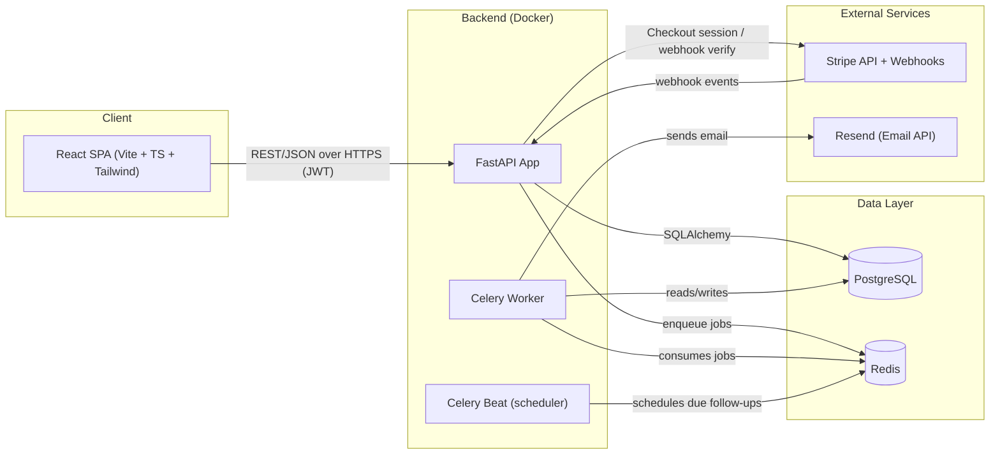
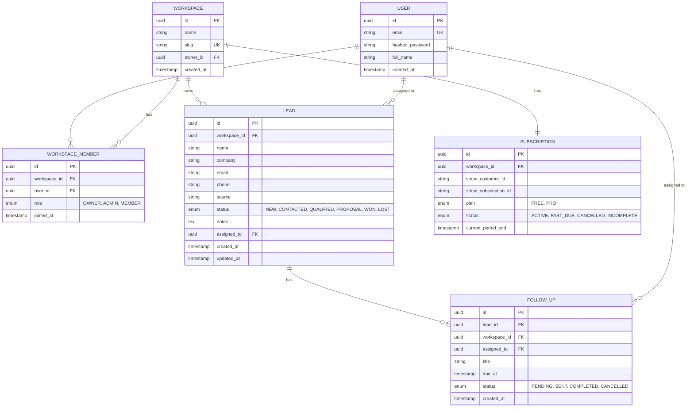
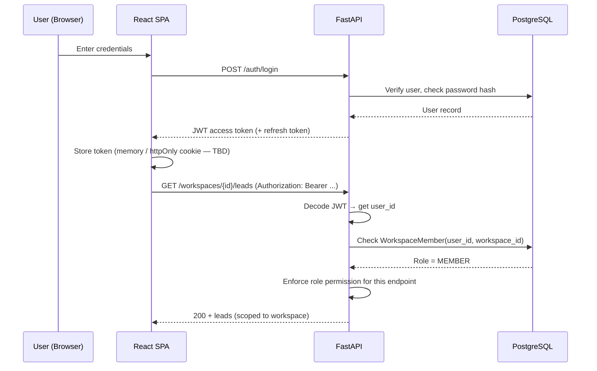
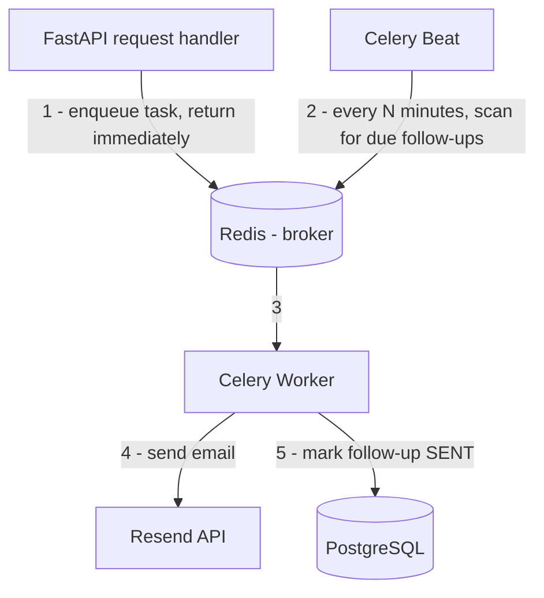
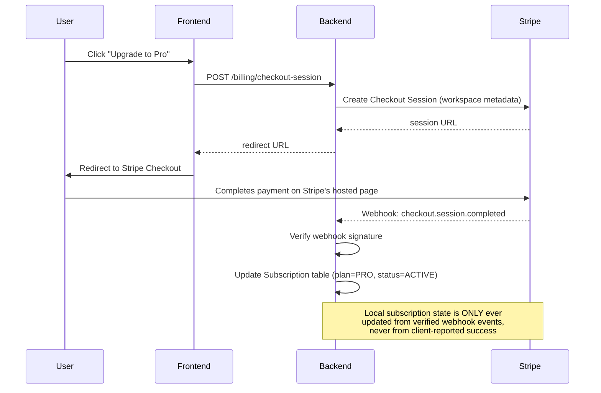

# ClientFlow — Phase 1: Architecture Proposal

**Status:** Awaiting approval. No implementation has begun.

---

## A. Final Architecture (Overview)

ClientFlow is a workspace-scoped, multi-tenant B2B SaaS. The architecture is a fairly standard three-tier design, chosen deliberately over anything fancier because the goal is to demonstrate you can build and defend a *correct, production-shaped* system — not to impress with novelty.

**Layers:**

1. **Frontend** — React + TypeScript SPA (Vite), talks to the backend only via REST/JSON over HTTPS. No server-side rendering, no BFF layer. A SPA is the right call here because there's no SEO requirement (it's a logged-in B2B tool) and it keeps the architecture explainable.
2. **Backend API** — FastAPI, organized in layers (routes → services → repositories → DB). Stateless; horizontally scalable behind a load balancer if it ever needed to be.
3. **Database** — PostgreSQL, single database, **shared schema with `workspace_id` discriminator column** (row-level multi-tenancy) rather than schema-per-tenant or database-per-tenant.
4. **Async workers** — Celery workers consuming from Redis, for anything that shouldn't block an HTTP request (emails, reminder scheduling, Stripe webhook side-effects).
5. **External services** — Stripe (billing), Resend (transactional email).

**Key architectural decision — tenancy model:**
Row-level tenancy (shared tables, `workspace_id` foreign key everywhere, enforced at the service layer) instead of schema-per-tenant. Schema-per-tenant is what people reach for when they want to *look* enterprise-y, but it adds migration and connection-pooling complexity that isn't justified at this scale, and it's harder to reason about in a portfolio review. Row-level tenancy with **explicit, testable authorization checks** is the more defensible choice and it's what most real early-stage SaaS products actually run on.

---

## B. System Architecture Diagram



---

## C. Database ERD



**Notes on the schema:**
- `workspace_id` is denormalized onto `FOLLOW_UP` even though it's derivable via `LEAD.workspace_id`. This is intentional — it lets you write authorization checks and indexes directly against `FOLLOW_UP` without a join, which matters once you're enforcing tenant isolation on every query.
- `WORKSPACE.owner_id` and the `OWNER` role in `WORKSPACE_MEMBER` are slightly redundant on purpose: `owner_id` answers "who can never be removed / who transfers ownership," while `WORKSPACE_MEMBER.role` answers "what can this person do." We'll discuss this tradeoff concretely in Phase 3 rather than hand-wave it now.
- `SUBSCRIPTION` is 1:1 with `WORKSPACE`, not per-user — billing is a workspace concern, not a user concern.

---

## D. Folder Structure

```
clientflow/
├── backend/
│   ├── app/
│   │   ├── main.py
│   │   ├── core/              # settings, security, JWT, exceptions
│   │   ├── db/                # session, base, engine
│   │   ├── models/             # SQLAlchemy ORM models
│   │   ├── schemas/            # Pydantic request/response schemas
│   │   ├── api/
│   │   │   └── v1/
│   │   │       ├── auth.py
│   │   │       ├── workspaces.py
│   │   │       ├── leads.py
│   │   │       ├── follow_ups.py
│   │   │       ├── billing.py
│   │   │       └── dashboard.py
│   │   ├── services/            # business logic (auth_service, lead_service, ...)
│   │   ├── repositories/        # DB access, isolated from business logic
│   │   ├── workers/             # Celery app + tasks
│   │   ├── integrations/
│   │   │   ├── stripe_client.py
│   │   │   └── email_client.py
│   │   └── tests/
│   ├── alembic/
│   ├── Dockerfile
│   ├── pyproject.toml / requirements.txt
│   └── .env.example
│
├── frontend/
│   ├── src/
│   │   ├── pages/
│   │   ├── components/
│   │   ├── features/            # leads/, pipeline/, followups/, billing/, team/
│   │   ├── api/                 # typed API client
│   │   ├── auth/                # auth context, protected route wrapper
│   │   ├── hooks/
│   │   └── lib/
│   ├── Dockerfile
│   └── .env.example
│
├── docker-compose.yml
├── docs/
│   └── architecture-diagram.md
└── README.md
```

This mirrors your Job Application Tracker's service-layer discipline (routes → services → repositories) rather than reinventing your own structure — you already know this pattern works and can defend it.

---

## E. API Endpoint Plan (high level — no implementation yet)

**Auth**
- `POST /api/v1/auth/register`
- `POST /api/v1/auth/login`
- `POST /api/v1/auth/refresh` *(decision needed in Phase 4 — see below)*
- `POST /api/v1/auth/logout`

**Workspaces**
- `POST /api/v1/workspaces`
- `GET /api/v1/workspaces/{id}`
- `PATCH /api/v1/workspaces/{id}`
- `POST /api/v1/workspaces/{id}/invite`
- `GET /api/v1/workspaces/{id}/members`
- `PATCH /api/v1/workspaces/{id}/members/{member_id}` (role change)
- `DELETE /api/v1/workspaces/{id}/members/{member_id}`

**Leads**
- `POST /api/v1/workspaces/{id}/leads`
- `GET /api/v1/workspaces/{id}/leads` (search, filter, paginate, sort)
- `GET /api/v1/workspaces/{id}/leads/{lead_id}`
- `PATCH /api/v1/workspaces/{id}/leads/{lead_id}`
- `DELETE /api/v1/workspaces/{id}/leads/{lead_id}`
- `PATCH /api/v1/workspaces/{id}/leads/{lead_id}/status`

**Follow-ups**
- `POST /api/v1/workspaces/{id}/leads/{lead_id}/follow-ups`
- `GET /api/v1/workspaces/{id}/follow-ups` (upcoming, mine)
- `PATCH /api/v1/workspaces/{id}/follow-ups/{id}`
- `DELETE /api/v1/workspaces/{id}/follow-ups/{id}`

**Billing**
- `POST /api/v1/workspaces/{id}/billing/checkout-session`
- `POST /api/v1/billing/webhook` (Stripe → server, not workspace-scoped in the URL)
- `GET /api/v1/workspaces/{id}/billing`

**Dashboard**
- `GET /api/v1/workspaces/{id}/dashboard`

Every workspace-scoped route enforces two things server-side, in this order: (1) the caller is authenticated, (2) the caller is a member of `{id}` with sufficient role — never trust a workspace_id in the URL alone.

---

## F. Frontend Page/Component Plan

**Pages:** Login, Register, Workspace Select/Create, Dashboard, Leads (list + filters), Lead Detail, Pipeline (kanban-style view over lead status), Follow-ups, Team, Billing/Settings.

**Structure approach:** feature-folder organization (`features/leads`, `features/pipeline`, `features/billing`, etc.), each owning its own components, hooks, and API calls, rather than a flat `components/` dump. Shared primitives (Button, Input, Modal, Table) live in `components/`.

**State/data approach (to finalize in Phase 6):** React Query (TanStack Query) for server state — caching, refetching, optimistic updates on lead status changes — plus a small auth context for the JWT/current user/current workspace. No Redux; there isn't enough client-only state to justify it.

**Auth flow on the frontend:** protected route wrapper checks for a valid token before rendering; workspace context is established after login (either the user's single workspace or a workspace-switcher if they belong to multiple).

---

## G. Authentication / Authorization Flow



**Two decisions I want your input on before Phase 4, not just to note here:**

1. **Token storage:** httpOnly cookie (safer against XSS, but needs CSRF handling) vs. in-memory/localStorage token (simpler, but more exposed to XSS). For a portfolio piece where you'll be asked "how do you handle token storage" in an interview, httpOnly cookie + CSRF token is the more defensible answer, but it's more work. I'll lay out both properly in Phase 4 and you decide.
2. **Refresh tokens:** whether to implement refresh token rotation now or ship short-lived access tokens only for v1 and note refresh as a documented future improvement. Given the portfolio-standard bar in section 21, I lean toward implementing it properly, but it's extra surface area — we'll weigh it then.

Authorization is **role-based, enforced in the service layer**, not just in route decorators — every service function that touches a `Lead`, `FollowUp`, or `WorkspaceMember` receives the acting user's role and workspace membership as arguments and checks them explicitly, so the permission logic is unit-testable independent of HTTP.

---

## H. Redis / Celery Architecture



**Why background jobs, not inline execution:** if the follow-up reminder email were sent synchronously inside the API request that creates or checks a follow-up, the request's latency and reliability would depend on Resend's API being up and fast — which has nothing to do with whether the *data* was saved correctly. Coupling those means a slow or failing email provider degrades your core CRUD experience. Splitting them means: the API's only job is to persist state correctly and respond fast; a separate worker, on its own schedule and its own retry policy, handles delivery. It also means reminders that are due *in the future* (not at creation time) can be sent at all — an inline request-time send can't do that.

**Two job types:**
1. **Beat-scheduled scan** — every few minutes, a Celery Beat task queries for `FollowUp` rows where `due_at <= now()` and `status = PENDING`, and enqueues one reminder task per hit.
2. **Reminder task** — sends the email via Resend, then updates `FollowUp.status = SENT`. Idempotent by design (checking status before sending) so retries don't double-send.

This will be discussed in more depth with retry/backoff policy specifics in Phase 7.

---

## I. Stripe Architecture



**Key principle:** the frontend redirect back from Stripe ("success page") is treated purely as a UX signal — it never triggers a plan upgrade by itself. Only a signature-verified webhook event does. This is the single most important security property of the billing integration and it'll be tested explicitly in Phase 9.

Events handled: `checkout.session.completed`, `customer.subscription.updated`, `customer.subscription.deleted`. Webhook signature verification uses Stripe's signing secret from environment config, never trusting the payload without it.

---

## J. Development Phases

| Phase | Deliverable |
|---|---|
| 1 | Architecture (this document) — **awaiting your approval** |
| 2 | Project skeleton + dev environment |
| 3 | Database, models, migrations |
| 4 | Authentication + authorization |
| 5 | Lead management |
| 6 | Frontend, wired to API |
| 7 | Redis + Celery + follow-up notifications |
| 8 | Stripe |
| 9 | Testing, security review, error handling |
| 10 | Docker, deployment, documentation |

I'll stop at the end of each phase and wait, as instructed — including flagging anything mid-phase that changes an earlier decision, rather than silently working around it.

---

## K. Risks and Key Technical Decisions to Track

1. **Tenancy enforcement is the single biggest risk in this codebase.** A single missed `workspace_id` filter or role check is a data leak between tenants — this is exactly the kind of bug that's invisible in a demo and fatal in a client conversation. Phase 5 and Phase 9 will include explicit isolation tests (a MEMBER of Workspace A must get a 404, not a 403, when requesting a lead from Workspace B — 403 confirms the resource's existence, which is itself a minor leak).
2. **Webhook idempotency.** Stripe can and will retry webhook deliveries. The handler must be safe to run twice on the same event (e.g., keying off `stripe_event_id` or checking current state before applying a transition).
3. **Celery Beat scheduling drift vs. correctness.** A due-follow-up scan running every N minutes means reminders fire within a window, not at the exact second — worth being able to explain that tradeoff (why not a per-task `apply_async(eta=...)` at creation time instead — we'll cover both approaches in Phase 7 and you should be able to argue for whichever we pick).
4. **JWT token storage tradeoff** (flagged in section G above) — needs a decision before Phase 4 starts.
5. **Scope creep.** This spec already includes RBAC, billing, async processing, and multi-tenancy — genuinely enough for a strong portfolio piece. The temptation will be to add things (audit logs, granular permissions, multi-currency billing); resisting that is part of the "MVP, not Salesforce" discipline stated in section 1, and I'll push back if a request drifts that direction.
6. **Given your current 30-day DSA sprint**, this is a meaningfully sized project — worth being explicit that we're taking it phase-by-phase rather than in one sitting so it doesn't compete for the same hours as interview prep. Your call on pacing, just flagging it since scope-vs-time tradeoffs are worth being deliberate about, not accidental.

---

Awaiting your review/approval before Phase 2 (project skeleton + dev environment).
